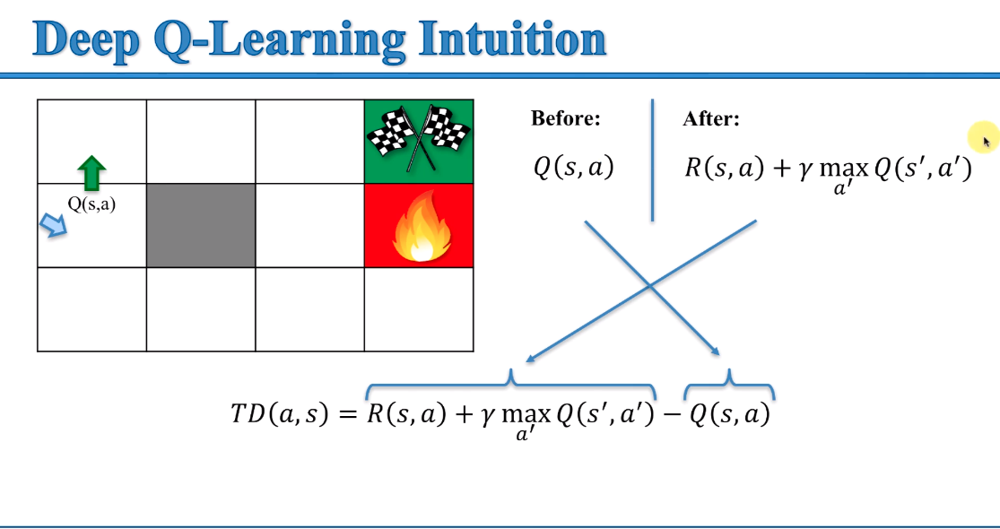
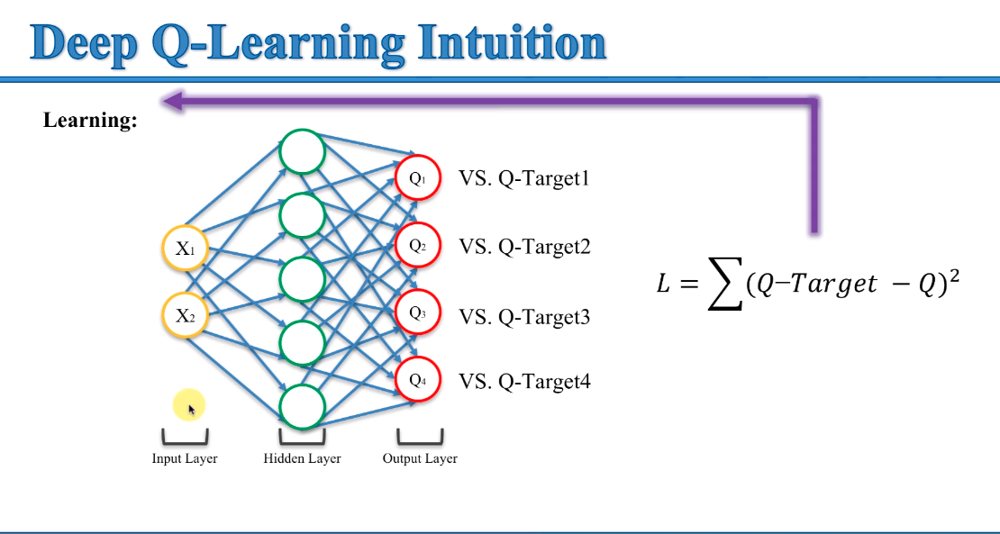
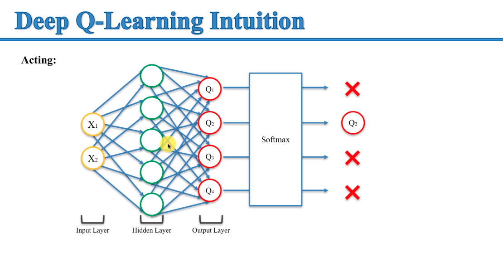
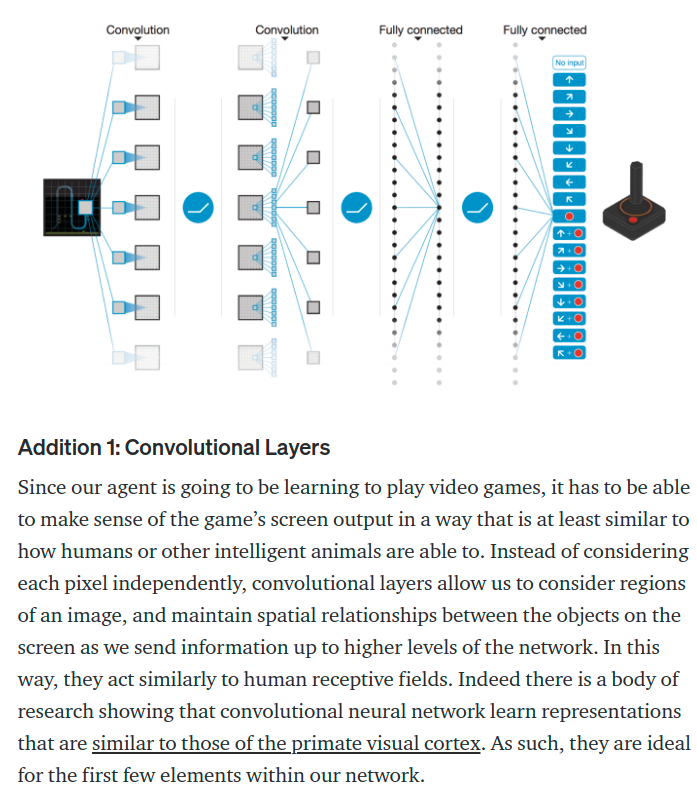
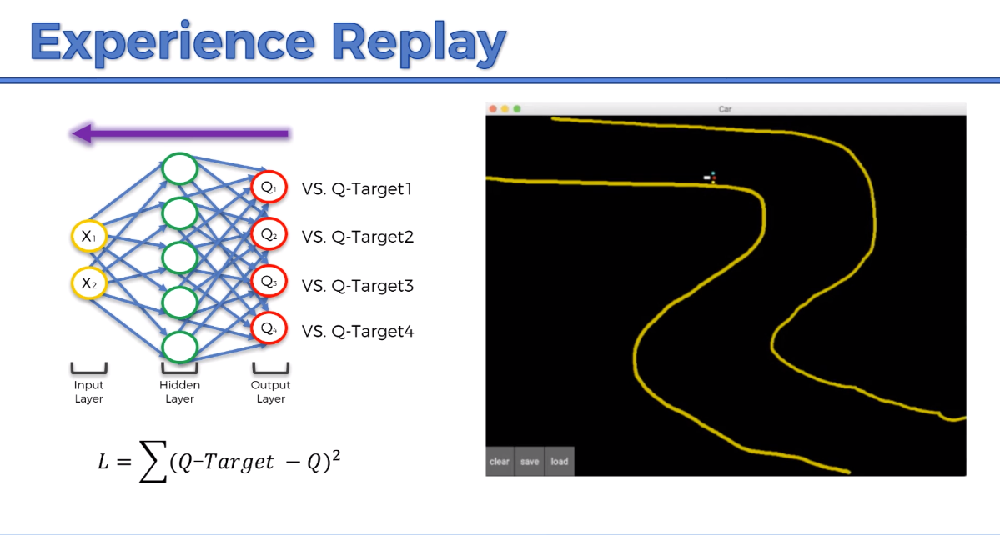
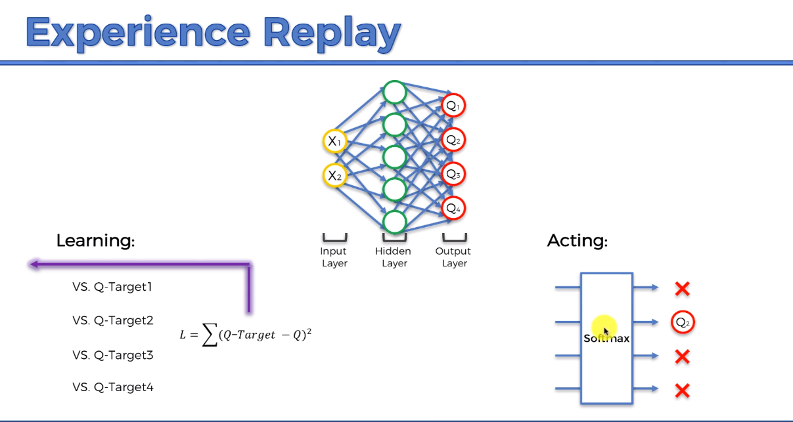
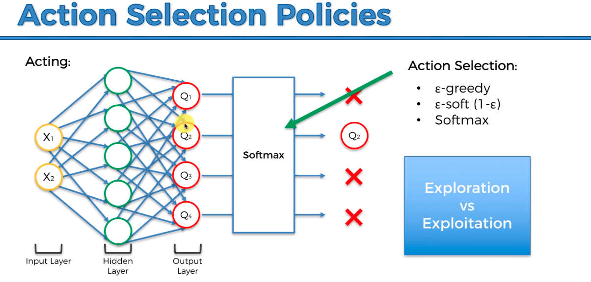

<h1>Reinforcement Learning</h1> 

What is it? An agent will perform an action in an evnironment and the state will change each time leading to a reward or no reward. By doing so
the agent learns the environment and better navigates. The performance of the agent is rewarded dependent on its actions. If the agent compeletes
the correct actions at the correct time with the correct order, leads to completion of a task. You reinforce the actions of the agent,
based on positive or negative returns. In terms of AI, think of reinforcement learning with dogs except with AI the rewards are +1 or -1.

Reinforcement algorythms controll all the degrees of freedom along with the rewards for the actions of your AI. Through this learning process
AI can outperform pre-programmed machines. It can learn as it discovers what its goals and rewards are. 

<h1>Bellman Equation</h1>

Richard Ernest Bellman was a mathematician who developed his equation in 1953. 

The Bellman Equation states that the expected long-term reward for a given action is equal to the immediate reward from the current action combined with the expected reward from the best future action taken at the following state. Many actions can be taken and for every possible action the Bellman equation will determine values based on maximum reward. Its here to solve the problem of opportunity cost or the time value of money.

Bellman Equation = V(s) = maxa(R(s,a) + yV(s'))

Explanation = The expected returned Value(V) at the current state(s) is equal to the maximum value of any possible action(a) for the expected reward(R) for taking that action(a) at state(s)...plus the discount factor(gamma -yV) multipled by the value of the next state(s').

Check out the bellman_equation.py file to see how this is done in FrozenLake. WHen you run the code it basically gives you a 4 x 16 matrix that contains the values of each individual cell based on the perceived values in the script. These values could be transposed onto a visual grid to help the agent navigate an environment and its obstacles. 

Using Tensorflow you can apply this Q Table to a neural network. However, what you make up for in flexibility you lose in stability. 

The Plan

Make a map for the AI. Create an environment where we can place these values. 

<h1>Markov Decision Process</h1>

Deterministic Search - If agent decides to go up, with 100% probability it will go up
Non deterministic Search - Agent could have 80% chance it goes up, 10% it goes left, 10% it goes right. 

This is a more realistic model of the real world. This allows for randomness in the logic for the agent to better deal with the reinforcement learning process. 

Markov Process - A stochastic process has the markov property if the conditional probability distribution of future statues of the process (conditional on both past and present states) depends only upon the present state, not on the sequence of events that preceded it. A process with this property is called a Markov Process. 

Simply, a future state will only depend on where you are now, not how you got here. Markov doesnt care what caused the agents position, only the future position and present state.  

Markov Decision Process - Provides a mathematical framework for modeling decision making in situations where outcomes are partly random and partly under the control of a decision maker.

Simply, the MDP is the framework an agent will use to navigate the environment its in. 

Equation - V(s) = maxa(R(s,a) + yV(s'))

Explanation - The expected return values(V) at thae current state(s) equals the maximum value of any possible action(a) for the expected reward for taking action(a) at state(s) plus the discount factor(y - gamma) multiplied by the value of the next state(s).

<h1>Q-Learning Inuition</h1>

Q considers the value of action instead of the value of state. If you ave 4 actions, Q is a metric to compare the values. 

Equation for Deterministic Q Values = Q(s,a) = r + γ(max(Q(s’,a’))

Explanation = The "Q" values for a given state(s) and action(a) should represent the current reward(r) plus the maximum discounted future reward(y)
            expected according to our own table  for the next state(s) we would end in.

Simply - This defines the curent rewards from future rewards depending on our current state and the potential rewards of the future state. 
Why is it important - Data can be updated by using these accurate measures into tables of future rewards allowing for agents to make better decisions.

<h1>Temporal Difference</h1>

Heart and soul of Q learning. It allows the agent to calculate these values.

http://ai.berkeley.edu/reinforcement.html

Checkout gridworld.py to run a program that details q learning.

<h1>Deep Q Learning</h1>

Instead of basic states, we create an x and y axis. Now each state can be equal to a grid coordinate. We can feed this state into a neural network which can produce our Q values. We're taking the states of environment and understanding the actions to get the Q value. 

<h1>Deep Q Acting</h1>

Now that our agent knows the path it has to act upon the data. We pass it through a softmax function, which helps select the best path. This is how we feed in a reinforcement learning function into an environment.

https://awjuliani.medium.com/simple-reinforcement-learning-with-tensorflow-part-4-deep-q-networks-and-beyond-8438a3e2b8df

This article goes more into convolutions which deals with your agent "Seeing" its environment.

<h1>Experience Replay</h1>  In the case of the self driving car. The question is what is and how often do we trigger our neural link? Everytime the car movies, calculates an error, or takes a new state - we experience issues whenever we repeatedely complete the same inputs or values into the network the car will learn one thing very well but wont learn to adjust into random or unknown states.

Once we have many of the same states, they become interdependent which means our car only learns to drive on the line.

IN order to avoid this we have the car take a uniformly random sample of the enivronment, essentially making all paths equal temporarily. 

Each expereicen is characterized by the state it took, the states its in, the action, then reward. THis is how it breaks the bias of experience replay. ER gives you many leaning experiences because the acrued data is kept in batches.

<h1>ACtion Selection Policies</h1>

Softmax or different action selection policies select Q values based metrics of exploration or exploitation.

Sometimes the agent may find in exploration that it finds efficient but will remain bias without a new reward. This could get it out of the local maxim its stuck in.
We uses ASPs to continue exploiting good values, but you also want it to keep learning. 

Epsilon Greedy, Epsilon Soft, Softmax

http://tokic.com/222/tokicm/publikationen/papers/AdaptiveEpsilonGreedyExploration.pdf